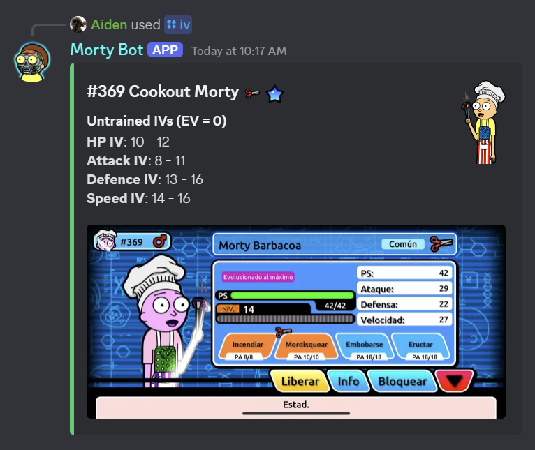

   # MortyBot

   MortyBot is a Discord bot for calculating IVs for Mortys in the game Pocket Mortys.

   ## Bot Output Example

   [Your image description here]

   

   ## Features

   - Calculate IVs for Mortys based on screenshots
   - Display Morty information including type and rarity
   - Support for both untrained and fully trained Mortys

   ## Setup

   - add your token to the config.json file
   - add the path to your tesseract.exe to the config.json file
   - add the path to your morty_images folder to the config.json file
   - add the path to your All_Mortys.csv file to the config.json file

   ## Usage

   - use /iv to calculate the IVs of a Morty using a screenshot

   ## Configuration

   The bot uses a `config.json` file for configuration. Make sure to set up your Discord bot token and other necessary settings.
